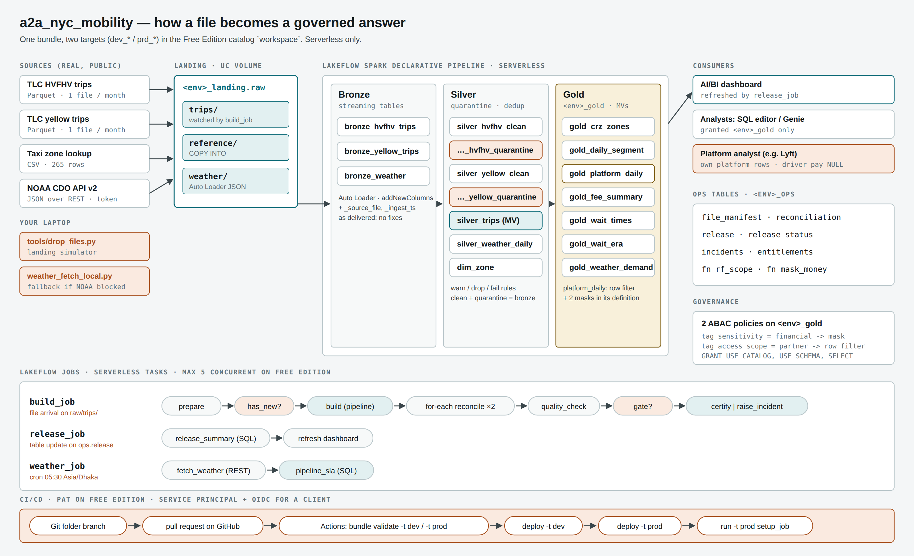

# NYC Congestion Pricing & the Ride-Hail Marketplace

**Author:** Enamul Hasan · enamul.hasan@bjitgroup.com · BJIT Data & Platform Engineering
**Variant:** A (NYC congestion pricing & ride-hail) · **Platform:** Databricks Free Edition (serverless)

> **Did the Congestion Relief Zone change demand, prices, driver pay and service levels?**
> `[fill after Day 5 — two sentences, with numbers. Example shape: "Trips touching the zone fell X% after
> 5 January while trips elsewhere changed Y%, a gap of Z points that survives excluding the holidays.
> Driver share of the base fare moved from A to B; p90 waits in the zone moved by C minutes."]`

Every figure below reconciles to the TLC source files month by month (`ops.reconciliation`, evidence E2),
passes a quality gate before it is published, and is visible to each platform analyst only for their own
platform, with driver pay masked unless they are entitled to it.

---

## Contents

1. [How to run it](#1-how-to-run-it) · 2. [Environment findings](#2-environment-findings) ·
3. [Architecture](#3-architecture) · 4. [Ingestion decisions](#4-ingestion-decisions) ·
5. [Schema evolution](#5-the-schema-evolution-event) · 6. [Silver rules](#6-silver-rules-and-thresholds) ·
7. [Gold objects](#7-gold-objects) · 8. [Orchestration](#8-orchestration-and-triggers) ·
9. [CI/CD](#9-cicd) · 10. [Backfill](#10-backfill-and-reconciliation) ·
11. [Performance](#11-performance-and-troubleshooting) · 12. [Access model](#12-access-model) ·
13. [Business answers](#13-business-answers) · 14. [For a real client](#14-what-i-would-change-for-a-real-client) ·
15. [Changes from the starter kit](#15-changes-from-the-starter-kit) · 16. [Three things I learned](#16-three-things-i-learned) ·
17. [Data sources](#17-data-sources-and-use)

Other documents: [`docs/evidence.md`](docs/evidence.md) (E1–E16) ·
[`docs/business-answers.md`](docs/business-answers.md) · [`docs/demo-script.md`](docs/demo-script.md) ·
[`docs/exam-notes.md`](docs/exam-notes.md) (27 checkpoint answers) · [`docs/architecture.png`](docs/architecture.png)

Day-by-day lab guides (step-by-step, with the "why" for every step): offline copies in [`docs/labs/`](docs/labs/)
([Day 1](docs/labs/day1.html) · [Day 2](docs/labs/day2.html) · [Day 3](docs/labs/day3.html) ·
[Day 4](docs/labs/day4.html) · [Day 5](docs/labs/day5.html)), and online:
[Day 1](https://claude.ai/artifact/QKcFwyh7x6KwNCsaopNHTd) · [Day 2](https://claude.ai/artifact/LqGkc5amMW6x3br6puTmUg) ·
[Day 3](https://claude.ai/artifact/UR7Yc6aZEtqSS84pKaJ15m) · [Day 4](https://claude.ai/artifact/QvqFBB25MxoiNsLUXkzfKh) ·
[Day 5](https://claude.ai/artifact/VPK1cy7aTBwUzVR8HzkXXd) (private until shared).

---

## 1. How to run it

A stranger should be able to go from `git clone` to a deployed, reconciled prod target with this section only.

### Prerequisites

| What | Why | Check |
|---|---|---|
| Databricks **Free Edition** workspace (not Community Edition) | Serverless compute, Unity Catalog, jobs, pipelines | You can open *SQL Warehouses* and see **Serverless Starter Warehouse** |
| Databricks CLI, a current 2026 release (v1.x) | `bundle validate / deploy / run`; `dataset_catalog` on dashboards | `databricks -v` |
| Python 3.10+ with `requests databricks-sdk pyarrow` | The landing simulator and the weather fallback run on your laptop | `python -c "import pyarrow, databricks.sdk"` |
| A GitHub account and a repository named `a2a_nyc_mobility` | Git folder, pull requests, GitHub Actions | — |
| A NOAA CDO token (free, arrives by e-mail) | REST ingestion of weather | https://www.ncei.noaa.gov/cdo-web/token |
| ~3 GB free disk on the laptop | The download cache (`.landing_cache/`, git-ignored) | — |

### First-time setup (dev)

```bash
# 0. Authenticate the CLI with a personal access token (Settings -> Developer -> Access tokens)
databricks configure                       # host = https://<your-workspace-host>, token = dapi...
databricks current-user me                 # must print your user

# 1. Put your workspace host into BOTH targets of databricks.yml (replace <your-workspace-host>)

# 2. Validate, deploy, bootstrap
databricks bundle validate -t dev
databricks bundle deploy   -t dev          # if a trigger is rejected on the first deploy: see "Bootstrap" below
databricks bundle run      -t dev setup_job

# 3. Land the development slice and the reference file
python tools/drop_files.py --download-only                                   # ~2 GB, once, in the background
python tools/drop_files.py --env dev --match taxi_zone
python tools/drop_files.py --env dev --match 2024-11 --sample-rows 1000000
databricks bundle run -t dev setup_job                                       # second task = COPY INTO

# 4. Weather (REST + secret). Store the token once, then run the notebook or the laptop fallback.
databricks secrets create-scope a2
databricks secrets put-secret a2 noaa_token
#    serverless can reach NOAA:   run src/ingest/weather_rest.py in the workspace (catalog/env widgets)
#    serverless cannot:           NOAA_TOKEN=... python tools/weather_fetch_local.py --env dev

# 5. Pipeline, then the orchestrated build
databricks bundle run -t dev lakehouse
databricks bundle run -t dev build_job
```

**Order matters on an empty target.** Auto Loader cannot infer a schema from an empty folder
(`CF_EMPTY_DIR_FOR_SCHEMA_INFERENCE`). Land at least one HVFHV file, one yellow file and the weather JSON
before the first pipeline run of any target.

### Bootstrap (first deploy of a target)

The first deploy of dev (and later prod) happens before `setup_job` has created `ops.release` and the
`raw/trips/` folder that the two triggers watch. If `bundle deploy` rejects a trigger because its table or
folder does not exist: comment out the two `trigger:` blocks in `resources/jobs.yml`, deploy, run `setup_job`,
restore the blocks and deploy again.
**Did I need it?** dev: `[fill yes/no]` · prod: `[fill yes/no]`

### Production

```bash
databricks bundle validate -t prod         # resolves prd_* schema names
databricks bundle deploy   -t prod         # normally done by GitHub Actions on merge to main
python tools/drop_files.py --env prd --match taxi_zone
databricks bundle run -t prod setup_job
databricks bundle run -t prod weather_job  # or: python tools/weather_fetch_local.py --env prd
python tools/drop_files.py --env prd --match 2024-11           # fires the file-arrival trigger
python tools/drop_files.py --env prd --batch 1 --interval 600  # the other six files, 10 minutes apart
```

Free Edition runs **one pipeline of a type at a time**: stop the dev pipeline before a prod run.

### Repository map

| Path | What it is |
|---|---|
| `databricks.yml` | Bundle: variables (`catalog`, `env`, `notify_email`, `warehouse_id`) and the `dev` / `prod` targets |
| `resources/pipeline.yml` | The Lakeflow Spark Declarative Pipeline (Bronze, Silver, Gold in three source files) |
| `resources/jobs.yml` | `setup_job`, `build_job` (file arrival), `release_job` (table update), `weather_job` (cron) |
| `resources/dashboard.yml.day5` | The dashboard resource; renamed to `dashboard.yml` on Day 5 |
| `src/setup/` | Schemas, Volume, ops tables, the release-status view, governance functions |
| `src/ingest/` | COPY INTO for the zone lookup; the NOAA REST notebook |
| `src/pipeline/` | `bronze.py`, `silver.py`, `gold.sql` — plain files, no notebook header |
| `src/jobs/` | The build job's notebooks: prepare, reconcile (for-each body), quality check, certify, incident |
| `src/sql/` | SQL tasks: release summary, pipeline SLA |
| `src/governance/` | Day 5: grants and UNDROP, entitlement states, ABAC |
| `src/perf/` | Day 4: tuning lab and layout lab |
| `src/analysis/` | `profile_bronze.sql` (Task 2.2 profiling) and `business_questions.sql` (BQ1–BQ4) |
| `src/dashboards/client_dashboard.lvdash.json` | The AI/BI dashboard |
| `tools/` | Landing simulator, smoke test, weather fallback — all run outside the pipeline |
| `.github/workflows/deploy.yml` | PR → validate; merge to main → deploy dev → deploy prod |
| `docs/` | Evidence pack, business answers, demo script, exam notes, architecture diagram, `labs/` (the five day guides) |

---

## 2. Environment findings

Recorded on Day 1 from `tools/00_smoke_test.py` and by hand. Every later fallback is justified by a row here.

| Check | Result | Consequence for the design |
|---|---|---|
| Workspace URL | `https://dbc-9e08a295-198c.cloud.databricks.com/` | Used in both targets and as `DATABRICKS_HOST` |
| CLI version | ` v1.17.0` | — |
| `session_user()` | `enamul.hasan@bjitgroup.com` | Must match the row in `ops.entitlements` exactly |
| Outbound: TLC trip files (CloudFront) | `reachable` | Landing always goes through the laptop simulator either way |
| Outbound: NOAA CDO API v2 | `reachable` | reachable → `weather_rest.py` in `weather_job`; blocked → `tools/weather_fetch_local.py` |
| Outbound: NOAA Access Data Service | `reachable` | Token-free fallback source (`--source ads`) |
| Outbound: PyPI (control) | `reachable` | Confirms the test itself works |
| Secret scopes visible | `Yes` | `a2` scope for `noaa_token` |
| Row filters on serverless | `Yes]` | Needed for `gold_platform_daily` |
| Governed tags (Catalog → Govern) | `can create` | yes → ABAC (Task 5.3); no → per-object masks in `gold.sql` |
| Invite a teammate | `Yes` | yes → a second real reader in Task 5.2; no → `account users` + entitlement states |
| Service principal + OAuth secret | `Yes` | yes → CI uses `DATABRICKS_CLIENT_ID/SECRET`; no → PAT in GitHub secrets |
| Groups: Source column | `Yes` | Governance here uses an entitlements table, not groups, so it works either way |
| Predictive optimization on `workspace` | `[fill Day 4]` | Decides whether `CLUSTER BY AUTO` works |
| SQL warehouse name | `Serverless Starter Warehouse` | `warehouse_id` lookup in `databricks.yml` |

---

## 3. Architecture



Three things make this production-shaped rather than a notebook exercise:

1. **Data arrives on its own and triggers the work.** The laptop simulator plays the upstream system and drops
   files into a Unity Catalog Volume; a file-arrival trigger starts the build job.
2. **Every run proves its numbers before anything is published.** Expected rows come from each file's
   Parquet footer; Bronze, Silver clean and quarantined rows must balance per file; a quality gate decides
   between certifying a release and raising an incident. Only a certified release refreshes the dashboard.
3. **The whole system is code in Git.** One bundle, two targets (`dev_*` and `prd_*` schemas in the same
   workspace), deployed by GitHub Actions.

### Unity Catalog layout (catalog `workspace`)

| Schema | Objects |
|---|---|
| `<env>_landing` | Volume `raw`: `trips/` (watched), `reference/`, `weather/` |
| `<env>_lakehouse` | `bronze_hvfhv_trips`, `bronze_yellow_trips`, `bronze_weather` (streaming tables); `silver_hvfhv_clean`, `silver_hvfhv_quarantine`, `silver_yellow_clean`, `silver_yellow_quarantine` (streaming tables); `silver_trips`, `silver_weather_daily`, `dim_zone` (materialized views); `ref_taxi_zone` (COPY INTO) |
| `<env>_gold` | `gold_crz_zones`, `gold_daily_segment`, `gold_platform_daily` (row filter + masks), `gold_fee_summary`, `gold_wait_times`, `gold_wait_era`, `gold_weather_demand` (materialized views); `v_release_status` (view) |
| `<env>_ops` | `file_manifest`, `reconciliation`, `release`, `release_status`, `incidents`, `entitlements`; functions `rf_scope`, `mask_money`; performance-lab tables |

Nothing deployed is hard-coded to dev or prd: catalog and prefix come from bundle variables, job parameters
and pipeline configuration (`a2.landing`, `a2.lakehouse`, `a2.gold`, `a2.ops`). The dashboard uses
unqualified table names and gets its schema from `dataset_schema: ${var.env}_gold`.

---

## 4. Ingestion decisions

| Source | Method | Why this one |
|---|---|---|
| TLC HVFHV trips (Parquet, 1 file / month, ~0.5 GB) | **Auto Loader → streaming table** (`bronze_hvfhv_trips`) | Files keep arriving; each must be processed exactly once; the schema changes in January 2025 (`cbd_congestion_fee`), which Auto Loader's `addNewColumns` handles. |
| TLC yellow trips (Parquet, 1 file / month) | **Auto Loader → streaming table** (`bronze_yellow_trips`) | Same reasons; separate stream because the columns differ. |
| Taxi zone lookup (CSV, 265 rows, static) | **COPY INTO** (`ref_taxi_zone`) | One small file, loaded by a re-runnable SQL command. COPY INTO remembers the files it has loaded, so a re-run inserts 0 rows. Auto Loader would be a streaming checkpoint for a file that never changes. |
| NOAA daily weather (JSON over REST, token) | **REST notebook + secret scope → JSON files in the Volume → Auto Loader (JSON)** | No managed connector exists for NOAA; the API needs a token (secret scope, never code); landing raw responses first keeps the pipeline file-based and replayable. |
| (Contrast) A SaaS app such as Jira | Lakeflow Connect managed connector | Databricks runs the incremental, governed ingestion. Not used here (stretch goal S1). |

`COPY INTO` second run: `num_inserted_rows = 0` (evidence E5). `[fill: screenshot reference]`

---

## 5. The schema-evolution event

Triggered in dev on Day 2 by dropping the January 2025 yellow sample, the first file carrying `cbd_congestion_fee`.

| Question | Answer |
|---|---|
| What failed? | `[fill: the pipeline update stopped with UnknownFieldException on bronze_yellow_trips — paste the event-log line]` |
| What restarted it? | `[fill: in development mode I started the update again by hand; in prod (Day 4, HVFHV) the production pipeline retried by itself — event-log reference]` |
| Where does the new column appear? | In `bronze_yellow_trips` as a new column, NULL for every 2024 row. Silver uses `col_or_null()` + `coalesce(..., 0)`, so `silver_*_clean.cbd_congestion_fee` is 0 before 2025 and the real fee after. |
| What is in `_rescued_data`? | `[fill: expected empty — addNewColumns adds the column instead of rescuing it. Rescued data holds values that do not fit the schema: type mismatches, case mismatches, fields not in the schema.]` |

---

## 6. Silver rules and thresholds

Profiled Bronze first (`[fill: link to the profiling query or evidence]`). Every drop rule is wrapped in
`coalesce(rule, false)` so a NULL fails the rule instead of slipping through; that keeps
**clean + quarantine = Bronze exactly**, per file. Quarantined rows carry a `quarantine_reasons` array with
the names of the rules they broke, so every quarantined row is explained.

| Rule | Behaviour | Threshold | Reason | Rows affected (prd) |
|---|---|---|---|---|
| `has_source_file` | **fail** | `_source_file IS NOT NULL` | Structural invariant: without it nothing reconciles, so stop everything | `[fill: 0]` |
| `dropoff_after_pickup` | **drop** → quarantine | `dropoff_ts > pickup_ts` | An impossible trip | `[fill]` |
| `duration_1_to_360_min` | **drop** → quarantine | 60 s ≤ `trip_time_s` ≤ 21,600 s | Under a minute is a meter never started; over 6 h is a meter left on | `[fill]` |
| `distance_0_to_200_mi` | **drop** → quarantine | 0 ≤ `trip_miles` ≤ 200 | Negative or >200 mi is a GPS or meter fault. **Zero is kept**: real cancelled-at-kerb trips | `[fill]` |
| `known_zones` | **warn** | both zone ids in 1–263 | 264/265 are unknown / outside NYC: keep but count; they fall into the `outside` segment | `[fill]` |
| `fare_non_negative` | **warn** | `passenger_fare >= 0` | Some negatives are genuine refunds | `[fill]` |
| `wait_non_negative` | **warn** | `request_ts IS NULL OR pickup_ts >= request_ts` | Negative waits are excluded from BQ3's percentiles (and counted there), not from Silver | `[fill]` |

`[fill: justify each threshold with one profiling number, e.g. "0.4% of HVFHV trips are under 60 s; the p99.99 duration is 3.1 h"]`

**De-duplication.** HVFHV trips have no id. The business key is `service, platform_code, pickup_ts,
dropoff_ts, pu_zone_id, do_zone_id, trip_miles, passenger_fare`, hashed into `_row_key`. Two trips that agree
on all eight are the same trip delivered twice; two real trips agreeing to the second on all eight, including
fare and distance, are vanishingly rare. De-duplication runs in the `silver_trips` materialized view because
a global de-duplication in a stream needs unbounded state or a watermark that can silently drop late rows.
Rows removed: `[fill]` (`sum(silver_*_clean) − count(silver_trips)`).

**Which period does a trip belong to?** The **file** defines the reconciliation period (every check is per
`_source_file`). The **pickup timestamp** defines the analytical period: Gold uses only trips with a pickup
date from 1 Nov 2024 to 28 Feb 2025. Trips dated outside that window stay in Silver but are left out of Gold,
because a stray date would otherwise become an extra "day" and distort trips-per-day averages.
Rows outside the window: `[fill]`.

**Timestamps** are New York wall-clock time without a zone. Databricks reads these Parquet timestamps as
`TIMESTAMP_NTZ` `[fill: confirm with DESCRIBE bronze_hvfhv_trips]`, so no time-zone conversion happens and
`spark.sql.session.timeZone` is never changed. Durations use `timestampdiff(SECOND, …)`.

**Columns dropped.** `airport_fee`, `congestion_surcharge`, `bcf`, `sales_tax`, `tolls`, the flags and the
base numbers are not carried into Silver: no business question needs them. `on_scene_datetime` is only filled
for wheelchair-accessible dispatches and is not used.

Pipeline data-quality view, expectation metrics: evidence E4.

---

## 7. Gold objects

Every Gold object is built from Silver (through the pipeline-private view `v_trip_segments`), never from
another governed Gold object.

| Object | Type | Grain | Why this type |
|---|---|---|---|
| `gold_crz_zones` | MV | zone | A zone's status depends on *all* its 2025 pickups; the list must be recomputed as months arrive. A zone is in when ≥ 90% of its pickups from 6 Jan carry a fee **and** it has ≥ 200 such pickups. |
| `v_trip_segments` | temporary view | trip | Shared logic (study window + `crz_segment`) used by five objects; no storage, private to the pipeline. |
| `gold_daily_segment` | MV, `CLUSTER BY (service_date)` | date × service × platform × segment | Aggregates over many files and must reflect de-duplication and zone changes; additive measures only. |
| `gold_platform_daily` | MV + row filter + 2 masks | date × platform × segment | The governed object; filter and masks are in the definition, so every refresh keeps them. |
| `gold_fee_summary` | MV | month × fee era × platform × segment | January holds both eras, so `fee_era` is part of the grain. |
| `gold_wait_times` | MV, `CLUSTER BY (service_date)` | date × hour × platform × segment | Daily p50/p90 trend for the dashboard. |
| `gold_wait_era` | MV | fee era × hour (and all hours) × platform × segment | Percentiles are not additive; before/after answers need percentiles over each whole era. |
| `gold_weather_demand` | MV | date × service | A join to weather that must be recomputed when NOAA revises a value. |
| `v_release_status` | view | one row | Lets gold readers see the release status without any grant on `ops`. |

Why not streaming tables in Gold: a streaming table processes each input row once and never revisits it, so
an aggregate would never see a late duplicate removed or a zone reclassified. Why not plain views: every
dashboard tile would re-aggregate ~95M rows.

---

## 8. Orchestration and triggers

**Build job DAG** (evidence E7): `prepare → has_new (if/else) → build (pipeline) → reconcile_each (for-each
over periods, concurrency 2) → quality_check → gate (if/else) → certify | raise_incident`.

| Setting | Where | What it does |
|---|---|---|
| `max_retries: 2`, `min_retry_interval_millis: 60000` | `prepare` | A transient failure (listing the Volume, reading a footer) is retried twice, a minute apart, before the task fails |
| `max_retries: 1`, `min_retry_interval_millis: 120000` | `build` | One retry two minutes later: covers a transient pipeline failure and "another update is active" on Free Edition |
| `max_concurrent_runs: 1` + `queue.enabled` | job | A drop that arrives during a run waits in the queue instead of overlapping |
| `concurrency: 2` | for-each | Free Edition allows 5 concurrent tasks per account |
| `email_notifications.on_failure` | every job | `raise_incident` fails the run on purpose so the e-mail goes out (evidence E8) |

**Incident branch** (evidence E8): `databricks bundle run -t dev build_job --params max_quarantine_pct=-1` →
gate false → `ops.incidents` row → failed run → e-mail.

| Job | Trigger | Why | What the alternative would get wrong |
|---|---|---|---|
| `build_job` | File arrival on `raw/trips/` | Files come when the upstream system is ready | Cron: runs before the file (empty/partial run) or long after (stale answers), and burns compute either way |
| `release_job` | Table update on `ops.release` | Downstream work should follow a *certified* change | Cron or file arrival: the dashboard could refresh with numbers that failed the gate |
| `weather_job` | Cron, daily 05:30 Asia/Dhaka | NOAA publishes on its own schedule and revises recent values, with no event to subscribe to | File arrival has nothing to watch: the files are created by this job |

Triggers are paused in `mode: development`, so they were proved in prod (evidence E9).

---

## 9. CI/CD

| Step | What I did | Evidence |
|---|---|---|
| Git folder | Created from this repository; branch `feature/gold-kpis`, changed a Gold object, committed, pushed | `[fill]` |
| Pull request | Opened and merged on GitHub (Git folders do not create PRs) | `[fill]` |
| Conflict | Same line edited in the workspace and on GitHub; resolved in the Git folder UI | `[fill screenshot]` |
| One variable, two environments | `bundle validate -t dev` → `dev_lakehouse`; `-t prod` → `prd_lakehouse` | `[fill]` |
| Target override | `[fill: e.g. extra notification address only under targets.prod.resources.jobs.build_job]` | `[fill]` |
| GitHub Actions | PR → `validate`; merge → `deploy-dev` → `deploy-prod` (+ `setup_job`) | E10 |
| No secrets in Git | `git grep -i token` finds nothing but variable names | `[fill]` |

**Variable vs target override.** A variable is one named value substituted wherever it is referenced, with a
different value per target (`env: dev` / `env: prd`). A target override merges a whole block of settings over
the top-level resource for one target only (for example an extra notification list in prod), without a
variable for it.

**Service principal or token?** On Free Edition there are no account-level APIs, so CI uses a personal access
token stored as GitHub secrets `DATABRICKS_HOST` / `DATABRICKS_TOKEN`. `[fill: or SP if the smoke test allowed]`.
For a client: a service principal per environment, GitHub OIDC federation (no stored secret), `run_as` set to
that principal, and prod deploys gated by a GitHub environment with a required reviewer.

---

## 10. Backfill and reconciliation

Seven prod build runs, one per file, 10 minutes apart (`--batch 1 --interval 600`).

| Run | File(s) | Trigger | Pipeline duration | Whole run | Notes |
|---|---|---|---|---|---|
| 1 | `fhvhv/yellow 2024-11` (Task 3.3) | File arrival | `[fill]` | `[fill]` | |
| 2 | `fhvhv 2024-12` | File arrival | `[fill]` | `[fill]` | |
| 3 | `yellow 2024-12` | File arrival | `[fill]` | `[fill]` | |
| 4 | `fhvhv 2025-01` | File arrival | `[fill]` | `[fill]` | Schema evolution in the prod HVFHV stream: retried by itself? `[fill]` |
| 5 | `yellow 2025-01` | File arrival | `[fill]` | `[fill]` | |
| 6 | `fhvhv 2025-02` | File arrival | `[fill]` | `[fill]` | |
| 7 | `yellow 2025-02` | File arrival | `[fill]` | `[fill]` | |
| | **Total** | | `[fill]` | `[fill]` | |

Reconciliation against Section 3 of the brief (evidence E2):

| Month | HVFHV file rows | Reference | Yellow file rows | Reference | Status |
|---|---|---|---|---|---|
| 2024-11 | `[fill]` | ~20.0M | `[fill]` | ~3.6M | `[fill OK]` |
| 2024-12 | `[fill]` | ~21.1M | `[fill]` | ~3.6M | |
| 2025-01 | `[fill]` | ~20.4M | `[fill]` | ~3.4M | |
| 2025-02 | `[fill]` | ~19.3M | `[fill]` | ~3.5M | |

Tolerance: the reference is TLC's trips-per-day × days, and a monthly file also contains trips dated outside
its month, so ±2% is expected. The file's own footer count is the source of truth, and there Bronze must match
exactly. `silver_trips` in prd: `[fill]` rows (must be > 50M).

---

## 11. Performance and troubleshooting

### Tuning (Task 4.2, `src/perf/perf_lab.py`, second run of each)

| Setting | Duration | Tasks (query profile) | Join strategy (`explain()`) |
|---|---|---|---|
| `shuffle.partitions=auto` | `[fill]` | `[fill]` | — |
| `shuffle.partitions=8` | `[fill]` | `[fill]` | — |
| `shuffle.partitions=4000` | `[fill]` | `[fill]` | — |
| `maxPartitionBytes=128MB` | `[fill]` | `[fill] scan tasks` | — |
| `maxPartitionBytes=16MB` | `[fill]` | `[fill] scan tasks` | — |
| broadcast hint | `[fill]` | `[fill]` | BroadcastHashJoin |
| merge hint | `[fill]` | `[fill]` | SortMergeJoin |

`[fill: what auto chose and why; why 8 was slower/faster; what I would change on a classic cluster —
autoBroadcastJoinThreshold (the size under which Spark broadcasts the small side; default 10 MB, -1 disables),
spark.executor.memory / spark.driver.memory (JVM heap per executor / for the driver), spark.default.parallelism
(default partitions for RDD operations, not DataFrame shuffles)]`

### Skew, spill, driver memory, repair (Task 4.3)

- **Skewed window** (`PARTITION BY platform_code`): `[fill: time per task, rows per task, spill, DATA_SKEW insight]`.
  **Fixed** (`PARTITION BY platform_code, pickup_date`): `[fill]`.
  Diagnosis in two sentences: `[fill]` (evidence E12).
- **Driver memory** (`collect()` of one month): `[fill: what happened]`. Fix: aggregate on the cluster and
  bring back an answer, not the data.
- **Library failure and repair run**: `%pip install this-package-does-not-exist==0.0.1` in `reconcile_period`
  → `prepare` and `build` green, for-each red. Removed, redeployed, **Repair run**: `[fill: which tasks re-ran,
  which kept their result]` (evidence E13).

### Layout (Task 4.4, `src/perf/layout_lab.sql`)

| Layout | numFiles | sizeInBytes | Files read | Bytes read | Duration |
|---|---|---|---|---|---|
| `PARTITIONED BY (pickup_date)` | `[fill]` | `[fill]` | `[fill]` | `[fill]` | `[fill]` |
| `CLUSTER BY (pickup_date, pu_zone_id)` | `[fill]` | `[fill]` | `[fill]` | `[fill]` | `[fill]` |

`[fill: three sentences — which layout won; why over-partitioning hurts (many small files, and pruning on only
one column); what predictive optimization would run for me (OPTIMIZE, VACUUM, ANALYZE on UC managed tables;
with CLUSTER BY AUTO it also picks the keys). Predictive optimization enabled on workspace? [fill]]`

### Monitoring notes (Task 4.5)

- Duration trend across build runs: `[fill]`
- Slowest run and its cause: `[fill: bigger batch / schema evolution / full refresh of silver_trips]`
- Expectation pass rates across periods: `[fill]`
- What a blocked DAG looks like: `[fill: upstream failed → downstream tasks show "Upstream failed"; branches
  not taken show "Excluded"]`

---

## 12. Access model

| Who | Sees | How it is enforced |
|---|---|---|
| Analysts (`account users` / invited teammate) | `prd_gold` only | `USE CATALOG` + `USE SCHEMA` + `SELECT` on the schema (inherited by future objects) |
| A platform analyst (e.g. Lyft, `HV0005`) | Only their platform's rows | `rf_scope` row filter: on `gold_platform_daily` in its definition; on every other tagged Gold object via the `partner_rows` ABAC policy |
| Anyone without `can_see_sensitive` | Driver-pay figures as NULL | `mask_money`: two column masks on `gold_platform_daily`; the `mask_financial_measures` ABAC policy elsewhere |
| The pipeline owner (me) | Everything, `'*'` / `true` | Must stay fully entitled: a refresh evaluates policies as the owner |

Both functions look up `session_user()` in `ops.entitlements`, so one account can demonstrate three roles
(evidence E15) and the model does not depend on groups (Free Edition groups may be workspace-local).

- **GRANT / REVOKE**: `SHOW GRANTS` before and after `REVOKE SELECT` (E15).
- **Managed vs external, in three sentences.** Dropping a managed table removes it from Unity Catalog and its
  data files are deleted after the retention window; within 7 days `UNDROP` brings it back. Dropping an external
  table removes only the metadata: the files stay in the external location and there is nothing to UNDROP.
  Free Edition has no external locations, so I demonstrated the managed half (`UNDROP` worked: `[fill]`).
- **Why ABAC scales better than per-table rules.** Two policies on the schema cover every column tagged
  `sensitivity = financial` or `access_scope = partner` — four objects today, and any future Gold object that
  carries the tags, with no new code. Per-table rules must be repeated on every object and a new object is
  unprotected until someone remembers. A table-owner can also remove a table-level mask with one `ALTER`; a
  schema-level policy is not theirs to remove.
- **Did the tags survive the next pipeline refresh?** `[fill]`
- **DENY and GRANT.** Unity Catalog DENY policies (ABAC, Beta) always win over grants — direct, inherited,
  through a group, or by ownership; metastore admins are exempt. Today only `MANAGE ACCESS CONTROL` can be
  denied, `SHOW GRANTS` does not list DENY policies, and creating them needs classic compute on DBR 18 LTS or
  later, which Free Edition does not have. Plain SQL `DENY` exists only for the legacy Hive metastore.

---

## 13. Business answers

SQL: `src/analysis/business_questions.sql` · results and plain-language answers: [`docs/business-answers.md`](docs/business-answers.md) ·
dashboard: `[fill link]` (refreshed by the release job; footer names both sources). Lineage from Bronze to the
dashboard: evidence E16.

---

## 14. What I would change for a real client

1. **Separate workspaces or at least separate catalogs** for dev and prod (`dev.*`, `prod.*`), instead of
   schema prefixes in one catalog; prod writable only by a service principal.
2. **A service principal with GitHub OIDC federation** for CI/CD, `run_as` on every job, and a required reviewer
   on the prod GitHub environment.
3. **Account-level groups** (e.g. `platform_uber`, `platform_lyft`, `finance_readers`) mapped to policies,
   instead of an entitlements table edited by hand — or keep the table but manage it through a reviewed process.
4. **External storage** for the landing zone (an external location on the client's cloud storage) with file
   events, instead of a laptop upload into a managed Volume.
5. **Alerting beyond e-mail**: webhook notifications to the on-call channel, and a Databricks SQL alert on
   `ops.incidents`.
6. **Cost control**: serverless budget policies and tags per job; move Gold MVs to incremental refresh where the
   query allows it, and stop the daily weather poll when no new months are expected.
7. **Tests in CI** (stretch goal S2): the conform and rule functions in a plain module, tested with pytest on
   local PySpark before `bundle validate`.
8. **A data contract with TLC's schema**: fail fast on type changes rather than discovering them in
   `_rescued_data`.

---

## 15. Changes from the starter kit

The starter kit was used as written, with these changes. Each one is small and reversible.

| # | File | Change | Why |
|---|---|---|---|
| 1 | `src/pipeline/silver.py` | Completed the TODOs: `conform_yellow`, `v_yellow_conformed`, `silver_yellow_clean`, `silver_yellow_quarantine` | Required by the kit |
| 2 | `src/pipeline/silver.py` | Quarantine tables gain `quarantine_reasons` (the drop rules each row failed) | The brief asks for bad records to be "quarantined and explained, not silently dropped" |
| 3 | `src/pipeline/silver.py` | Durations and waits use `timestampdiff(SECOND, a, b)` | Works the same for `TIMESTAMP` and `TIMESTAMP_NTZ`; clearer than subtracting `unix_timestamp` values |
| 4 | `src/pipeline/silver.py` | `v_trip_segments` keeps only pickups from 2024-11-01 to 2025-02-28 | Trips dated outside the study window (some years off) would become extra "days" in trips-per-day averages |
| 5 | `src/pipeline/gold.sql` | Completed the four TODO objects | Required by the kit |
| 6 | `src/pipeline/gold.sql` | Added `gold_wait_era` (percentiles over each whole era, by hour and all hours) | Percentiles are not additive; BQ3's before/after and "p50 and p90 by platform" need them computed over the whole era |
| 7 | `src/pipeline/gold.sql` | `gold_crz_zones`: a zone also needs ≥ 200 pickups from 6 Jan, and the window ends 28 Feb | Without a minimum, a zone with a handful of trips, all into Midtown, scores 100% and joins the zone |
| 8 | `src/jobs/quality_check.py` | The "own check": fail the gate if any zone in the derived CRZ is outside Manhattan; publish a `reasons` task value | A wrong zone list silently corrupts every `touches_zone` number |
| 9 | `resources/jobs.yml`, `src/jobs/raise_incident.py` | `raise_incident` receives the gate's `reasons` | The incident row says *why*, not only the quarantine % |
| 10 | `src/jobs/prepare.py` | Also re-queues periods that were registered earlier but never reconciled OK | Without it, a run that fails after `prepare` (then re-run with "Run now" instead of "Repair run") leaves its files registered and never reconciled |
| 11 | `src/setup/setup_objects.py` | Creates an empty `ops.release_status` and the view `<env>_gold.v_release_status` | Analysts are granted the gold schema only; the dashboard's status tile reads through the view |
| 12 | `resources/dashboard.yml` | Adds `dataset_catalog` / `dataset_schema`; queries use unqualified names | An exported dashboard hard-codes `workspace.prd_gold` in every query, breaking the kit's own rule that nothing deployed names dev or prd |
| 13 | `resources/dashboard.yml.day5` | Ships under a name `resources/*.yml` does not match | Lets the file live in the repo from Day 1 and be switched on for Day 5 with one `git mv` |
| 14 | `tools/weather_fetch_local.py` | New: the laptop fallback for Task 1.4, with a token-free `--source ads` option | The kit describes the fallback but does not provide it |
| 15 | `.gitignore` | New: ignores `.landing_cache/` and `.databricks/` | The cache is ~2 GB of Parquet |
| 16 | `src/perf/perf_lab.py` | Times the two join hints; shows the aggregate-first fix after the `collect()` | Gives Task 4.2 its seventh and later rows, and part 5 its answer |
| 17 | `tools/drop_files.py` | `--extra-months 2025-03` adds months beyond the four | After the backfill there is no unseen file left for the demo's live drop; a real new month is the honest demo |
| 18 | `src/analysis/profile_bronze.sql` | New: the Bronze profiling queries for Task 2.2 | Every threshold in §6 should be defended with a number from this file |

**A note on job parameters and `base_parameters`.** The Bundles documentation page on job parameters says
bundle validation "does not allow job-level `parameters` and task-level `base_parameters` in the same job"
(I repeated that claim in the Day 33 lab). The Databricks CLI source contains no such validator. The only
mutual exclusion is at `bundle run` time (task-level `--notebook-params` cannot be passed to a job that
defines job parameters), and the Jobs documentation allows both, warning only when a key is repeated. The
`build_job` here uses both, exactly as the kit does. If your CLI version rejects it, move `period` and `run_id`
into job-level parameters (`{{input}}` must stay on the for-each task).

---

## 16. Three things I learned

1. `[fill]`
2. `[fill]`
3. `[fill]`

---

## 17. Data sources and use

- **NYC Taxi & Limousine Commission trip records** — High-Volume For-Hire Vehicle and yellow taxi, November
  2024 to February 2025, and the taxi zone lookup. Published under New York City's Open Data law, available
  without registration or restrictions on use. Changes made: invalid trips quarantined by the rules in §6,
  duplicates removed, trips outside the study window excluded from Gold, columns not needed dropped.
- **NOAA NCEI Global Historical Climatology Network – Daily**, via the Climate Data Online API v2: Central Park
  (USW00094728), JFK (USW00094789), LaGuardia (USW00014732). A U.S. government work.
- **MTA Congestion Relief Zone**: tolling began 5 January 2025; per-trip charge $0.75 for yellow and green taxis
  and $1.50 for high-volume for-hire vehicles. The zone list in this project is derived from the data
  (`gold_crz_zones`), not typed in.
